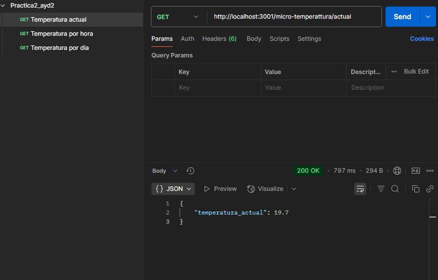

| Nombre | Carnet |
|--------|:--------:|
| Erick Abdul Chacón Barillas | 201807169 |
| Marco Pablo Mazariegos Macario | 201513760 |
| Nataly Saraí Guzmán Duarte | 202001570 |
| Erick Erasmo Jiménez Palacios | 201603171 |
| Douglas Darío Rivera Ojeda | 201122881 |

## Microservicio de temperatura
1. Obtener Temperatura Actual
El primer endpoint de nuestra API permite obtener la temperatura actual registrada. Este dato es esencial para sistemas que requieren conocer la temperatura en tiempo real, como aplicaciones de monitoreo o dispositivos IoT. Para acceder a esta información, se realiza una solicitud GET a la ruta /micro-temperattura/actual. La respuesta exitosa incluirá un objeto JSON con un solo valor: temperatura_actual, que contiene la temperatura medida en grados Celsius. 

2. Obtener Temperaturas por Hora
El segundo endpoint permite obtener las temperaturas registradas durante las últimas 24 horas, proporcionando un histórico detallado del comportamiento de la temperatura a lo largo del día. Al realizar una solicitud GET a la ruta /micro-temperattura/por-hora, el sistema devuelve una lista de objetos JSON, donde cada objeto contiene la hora (en formato de 24 horas) y la temperatura correspondiente a esa hora. Esta información es útil para visualizar cómo ha variado la temperatura a lo largo del tiempo, facilitando el análisis de tendencias o patrones.

3. Obtener Temperatura por Día
El cuarto endpoint permite obtener la temperatura registrada durante un período de 24 horas, pero con la particularidad de que muestra la temperatura promedio por día, es decir, el valor representativo de la temperatura para cada día de la semana o mes. Este endpoint es útil cuando se desea obtener una visión más general de cómo ha sido el comportamiento térmico a lo largo de varios días, sin enfocarse en los detalles por hora.

Para acceder a esta información, se realiza una solicitud GET a la ruta /micro-temperattura/por-dia. La respuesta incluirá un conjunto de datos donde se representará la temperatura promedio para cada día de la semana (o del mes, dependiendo de la implementación). Esto es útil para la visualización de tendencias de temperatura a lo largo de un período más largo, permitiendo comparar días de la semana, semanas o meses entre sí.

4. Generar Gráfica de Temperatura por Hora
 El sistema genera y devuelve una imagen de la gráfica de las temperaturas durante las últimos 7 días. Esta gráfica es consumida por una interfaz frontend, como una aplicación web o móvil, para visualizar de forma gráfica cómo la temperatura ha fluctuado a lo largo del día.

El uso de gráficos es una herramienta poderosa para la representación visual de datos, ya que permite que los usuarios comprendan rápidamente las variaciones en la temperatura sin necesidad de analizar grandes cantidades de datos. Este tipo de visualización es comúnmente utilizado en dashboards de monitoreo o en sistemas de alertas.
